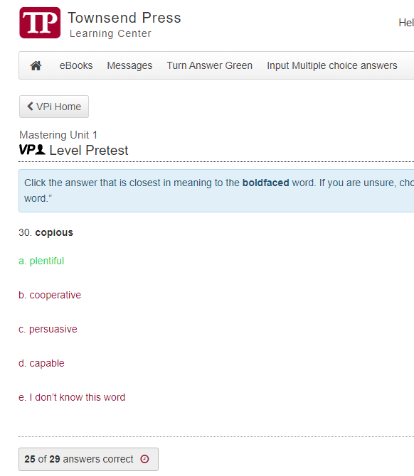

# TPCheat
A tool I made to auto solve Townsend Press questions.

# WARNING
This project is still very much work in progress. It will be updated whenever. The multiple choice option may not work. If so, wait for a new update.
</br>
</br>


# How to Use
## Text Tutorial:
* Fork this repository
* Go to the `script` file
* Edit and replace the "key" text (keep the quotation marks) with your api key from [OpenAI](https://platform.openai.com/account/api-keys). You can name it whatever. Doesn't matter. COPY THE API KEY WHEN IT POPS UP
* After you do this, click on the `RAW` button on the top right of the script.js file and copy the URL to the raw script.js file
* Paste the URL into the marked area below.
* Copy the entirety off the javascript function and create a bookmark
* Paste this into the page area and title the page anything you want.

```javascript:var%20script=document.createElement('script');script.src="REPLACE WITH THE GITHUB RAW URL YOU JUST COPIED";script.type="text/javascript";document.body.appendChild(script);```

* Open TownsendPress and click on the newly created bookmarklet
* Enjoy!

## Video Tutorial:
Will come soon.
